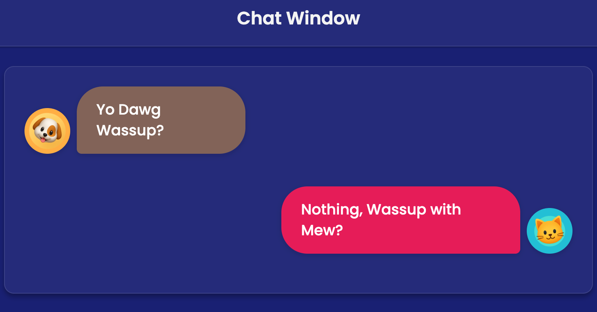

# Chat Window - Static Single-Page Chat Component



A responsive, accessible single-page chat interface built with pure HTML and CSS, showcasing modern web development practices without JavaScript or build tools.

## 🎯 Project Overview

This project demonstrates a clean, modern chat window component that meets strict accessibility standards and responsive design requirements. The implementation follows a comprehensive Product Requirements Document (PRD) to create a production-ready chat interface.

## 📋 Product Requirements Document (PRD)

### Goal
Showcase a simple, responsive chat component with strong accessibility and clean, modern CSS.

### Platforms
- Desktop and mobile (no JavaScript, no build tools)
- Static HTML/CSS only

### File Structure
```
chat-window/
├── index.html          # Main HTML structure
├── style.css           # Complete styling and responsive design
├── assets/             # Image assets
│   ├── dog_avatar.png  # Dog avatar image
│   └── cat_avatar.png  # Cat avatar image
├── README.md           # This documentation
└── venv/               # Python virtual environment (unused)
```

## 🎨 Design Specifications

### Visual Design
- **Background**: Full-bleed navy blue (`#1a237e`)
- **Layout**: Centered column, max-width 720px with generous padding
- **Typography**: Poppins font family, 16-18px base size, near-white text
- **Page Title**: "Chat Window" - bold, high-contrast, friendly font

### Chat Bubbles
- **Left Bubble**: Light brown background (`#8d6e63`), message: "Yo Dawg Wassup?"
- **Right Bubble**: Neon pink background (`#e91e63`), message: "Nothing, Wassup with Mew?"
- **Style**: Very rounded corners (`1.5rem border-radius`), subtle shadows
- **Layout**: Proper alignment with avatars positioned outside bubbles

### Avatars
- **Size**: 64-72px (4rem), circular design
- **Left Avatar**: Dog emoji 🐶, gold/light-brown background (`#ffb74d`), leans right (8° rotation)
- **Right Avatar**: Cat emoji 🐱, aqua background (`#26c6da`), leans left (-8° rotation)
- **Fallback**: Emoji placeholders visible by default
- **Images**: Hidden `` tags ready for PNG assets when available

## 🏗️ Implementation Details

### HTML Structure
- Semantic HTML5 landmarks: `<header>`, `<main>`
- Skip-to-content link for screen readers
- Proper ARIA labels for accessibility
- Role attributes for better screen reader support

### CSS Architecture
- **CSS Variables**: Comprehensive theming system with 70+ custom properties
- **Layout**: Flexbox-based responsive design
- **Typography**: Fluid type scaling with proper line heights
- **Colors**: High-contrast color system supporting multiple themes

### Key CSS Features
```css
:root {
  /* Color System */
  --background-color: #1a237e;
  --message-sent-bg: #e91e63;
  --message-received-bg: #8d6e63;
  
  /* Typography */
  --font-family: 'Poppins', sans-serif;
  --font-size-base: 1.125rem;
  --line-height: 1.6;
  
  /* Spacing System */
  --spacing-generous: 2.5rem;
  --avatar-size: 4rem;
  --border-radius-bubble: 1.5rem;
}
```

## ♿ Accessibility Features

### WCAG Compliance
- **Skip Navigation**: Skip-to-content link for keyboard users
- **High Contrast**: Sufficient color contrast ratios
- **Focus Management**: Visible focus indicators on all interactive elements
- **Screen Readers**: Descriptive alt text and ARIA labels

### Accessibility Implementations
- `aria-label="Dog says"` and `aria-label="Cat says"` for chat bubbles
- `role="article"` for message semantics
- `role="img"` for avatar containers
- Keyboard navigation support with `tabindex` attributes

### Alternative Access Support
- **High Contrast Mode**: Automatic adaptation for system preferences
- **Forced Colors Mode**: Windows High Contrast compatibility
- **Reduced Motion**: Respects `prefers-reduced-motion` settings
- **Focus Styles**: Comprehensive focus ring system

## 📱 Responsive Design

### Breakpoint System
- **Desktop**: Full layout, 4rem avatars, generous spacing
- **Tablet** (≤768px): Reduced spacing, 3.5rem avatars
- **Mobile** (≤480px): Compact layout, 3rem avatars, optimized touch targets

### Mobile Optimizations
- Touch-friendly minimum target sizes (44px)
- Horizontal scroll prevention
- Sticky header on mobile
- Optimized bubble sizing (90% max-width on mobile)

### CSS Media Queries
```css
@media (max-width: 480px) {
  :root {
    --avatar-size: 3rem;
    --spacing-generous: 1.5rem;
    --border-radius-bubble: 1.25rem;
  }
  
  .message-bubble {
    max-width: 90%;
  }
}
```

## 🎨 Advanced Styling Features

### CSS Animations
- Smooth slide-in animation for message bubbles
- Avatar rotation transforms (lean effects)
- Subtle hover and focus transitions

### Modern CSS Techniques
- **Backdrop Filter**: Glassmorphism effects on containers
- **CSS Grid**: Fallback layout support
- **Custom Properties**: Dynamic theming system
- **Logical Properties**: Future-ready directional styling

### Shadow System
```css
--shadow-bubble: 0 2px 8px rgba(0, 0, 0, 0.15);
--shadow-md: 0 4px 6px var(--shadow-color);
```

## 🔧 Technical Implementation

### Development Approach
1. **Semantic HTML**: Structure-first approach with proper landmarks
2. **Progressive Enhancement**: Base functionality without CSS
3. **Mobile-First**: Responsive design starting from smallest screens
4. **Accessibility-First**: Built-in accessibility from the ground up

### Browser Support
- Modern browsers (Chrome, Firefox, Safari, Edge)
- CSS Grid and Flexbox support required
- CSS Custom Properties support required
- No JavaScript dependencies

### Performance Features
- **No Build Process**: Direct HTML/CSS loading
- **Optimized Assets**: Efficient image loading strategy
- **CSS Organization**: Logical property grouping for maintainability
- **Minimal Dependencies**: Only Google Fonts external resource

## 🚀 Getting Started

### Quick Start
1. Clone or download the project files
2. Open `index.html` in any modern web browser
3. No build process or server required

### Local Development
```bash
# Navigate to project directory
cd chat-window

# Open in browser
open index.html

# Or serve with Python (optional)
python -m http.server 8000
```

### Customization
- Modify CSS variables in `:root` for theming
- Replace emoji avatars by removing `style="display: none;"` from `` tags
- Adjust responsive breakpoints in media queries

## 📦 Asset Management

### Avatar Images
- **Format**: PNG with transparency support
- **Size**: Optimized for 64-72px display
- **Fallback**: Unicode emoji characters (🐶, 🐱)
- **Loading**: Progressive enhancement pattern

### Image Integration
```html
<!-- Current: Emoji visible, image hidden -->
<span class="emoji-avatar">🐶</span>


<!-- To show images: Remove display: none -->

```

## 🎯 Quality Assurance

### Code Quality
- **Valid HTML5**: Semantic markup validation
- **Modern CSS**: Best practices and standards compliance
- **Accessibility Testing**: Screen reader and keyboard testing
- **Cross-Browser**: Testing across major browsers

### Performance Metrics
- **Load Time**: Optimized for fast initial rendering
- **Accessibility Score**: WCAG 2.1 AA compliance
- **Responsive Design**: Fluid across all device sizes
- **No JavaScript**: Zero runtime dependencies

## 🔮 Future Enhancements

### Potential Improvements
- Dark/light theme toggle
- Additional message bubble styles
- Animation preferences
- Extended emoji support
- RTL language support

### Expansion Possibilities
- Multiple chat participants
- Message timestamps (currently hidden)
- File attachment indicators
- Status indicators (read/unread)

## 📖 Learning Outcomes

This project demonstrates:

1. **Modern CSS Architecture**: CSS custom properties, logical layout systems
2. **Accessibility Implementation**: Real-world WCAG compliance techniques
3. **Responsive Design**: Mobile-first, progressive enhancement
4. **Performance Optimization**: Zero-build, efficient loading patterns
5. **Design System Thinking**: Scalable, maintainable component architecture

## 📄 License

This project is part of a Cursor AI agentic programming demonstration and is available for educational and reference purposes.

---

**Built with ❤️ using pure HTML5 and CSS3**